# Prueba Susano Pacheco

## Base de datos
Como motor de base de datos se usó MySql. Se crearon cuatro tablas:
* cliente
* producto
* factura
* factura_producto

Dentro de la carpeta scripts hay dos archivos sql:
* ddl.sql: Data definition language, aquí se encuentran los scripts para crear la base de datos y las tablas.
* dml.sql: Data manipulation language, aquí se encuentran los scripts de inserciones, consultas, actualizaciones y eliminaciones. 

El modelo entidad relación es el siguiente:
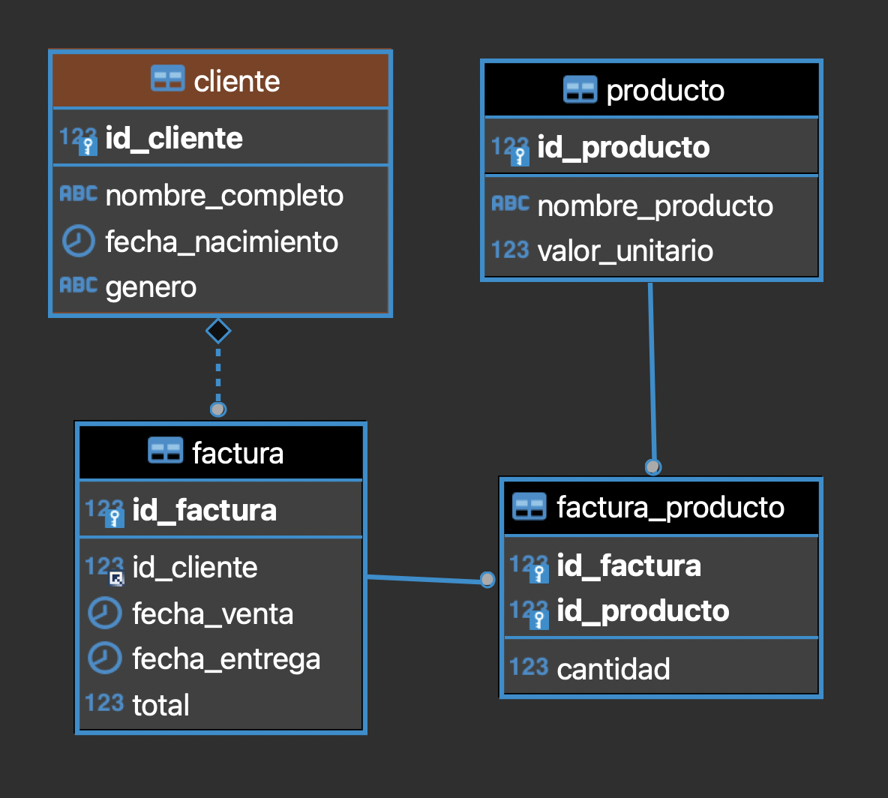

## API
Para el desarrollo del API se usó java versión 17 y spring boot como framework de desarrollo. La tabla que se usó para el desarrollo de la tabla fue `producto`. Para ejecutar el proyecto localmente puede abrir la carpeta api con el ide de su preferencia y ejecutar la clase `ApiApplication`. Esto iniciará los servicios rest en el puerto 8080. Debe tener instalado java 17.

Dentro de la carpeta documentación se encuentra un archivo llamado `productos.postman_collection.json` que puede importar en postman para consumir los servicios expuestos en el API.

A continuación se muestran las respuestas del API:

* Listado de peticiones:
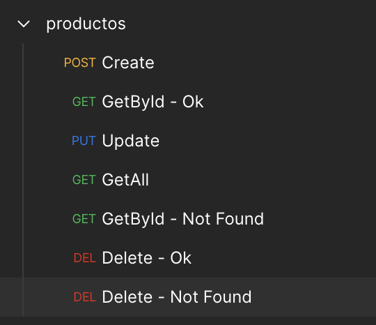


* Crear producto:
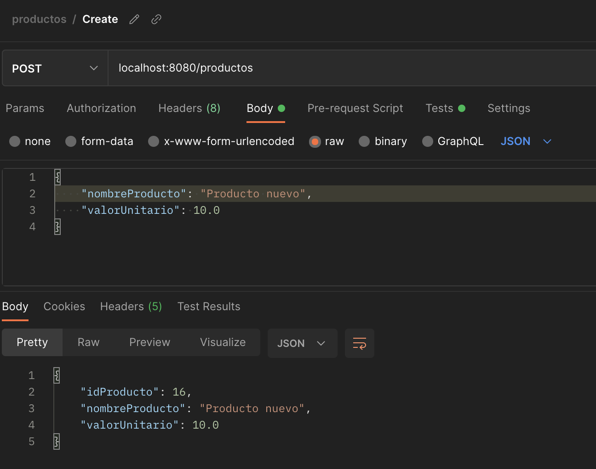


* Crear producto - tests, se guarda en una variable de postman el id del producto creado para usarlo en las siguientes peticiones:
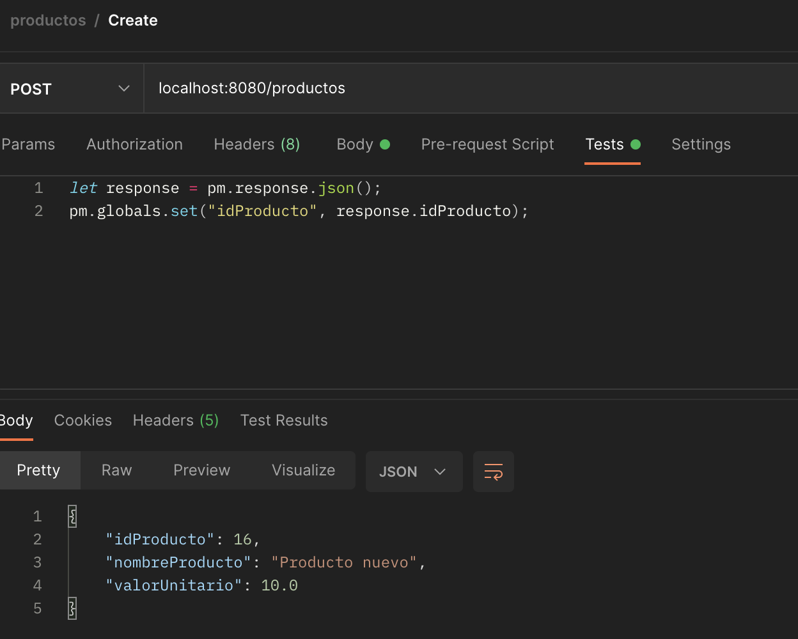


* Consultar producto:
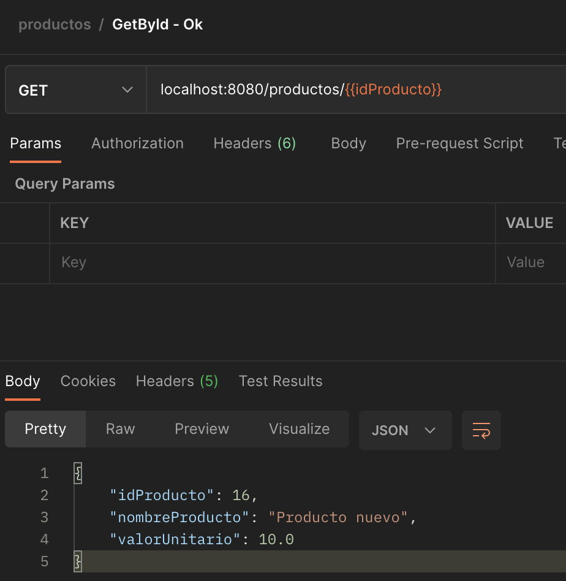


* Consultar producto - producto inexistente:
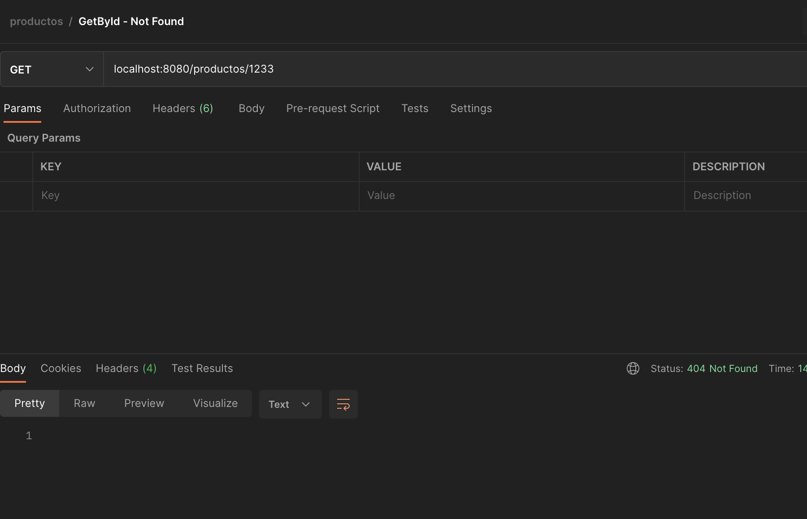


* Actualizar producto:
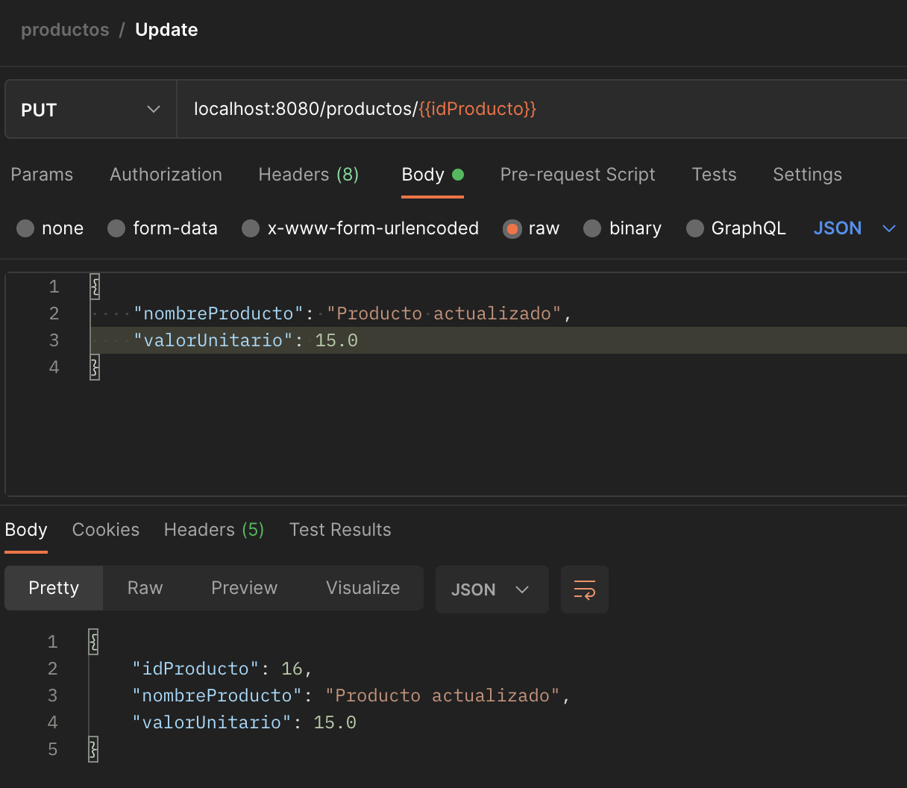


* Consultar todos los productos:
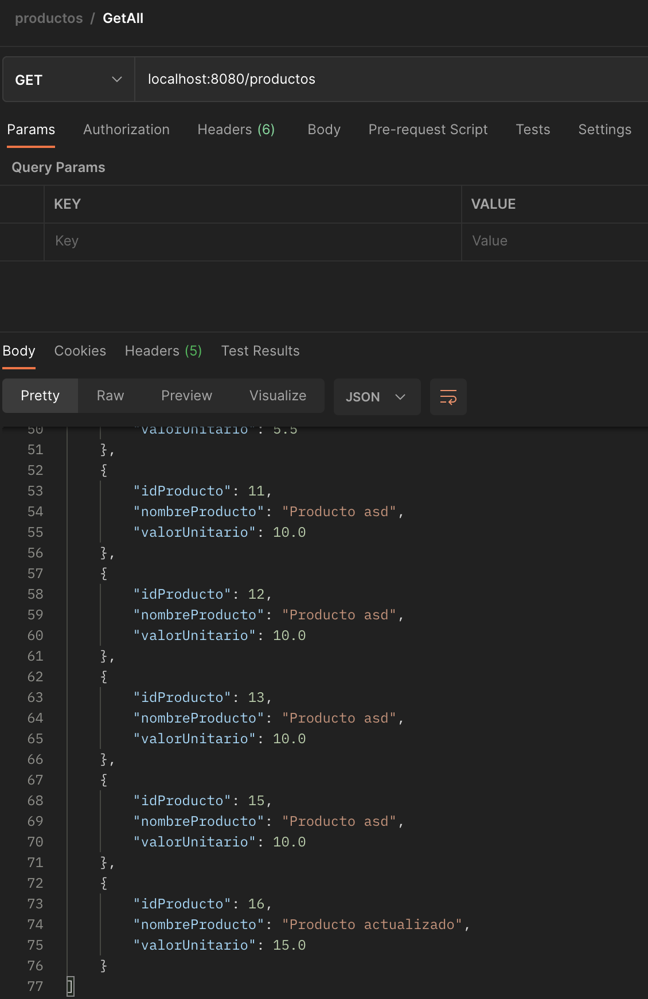


* Borrar producto:
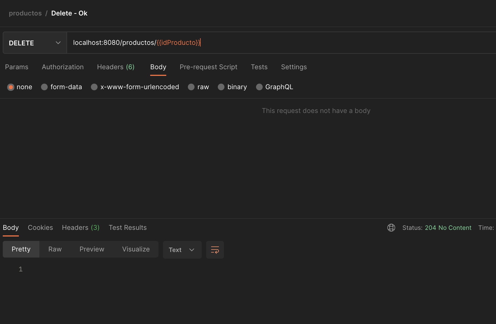


* Borrar producto - producto inexistente:
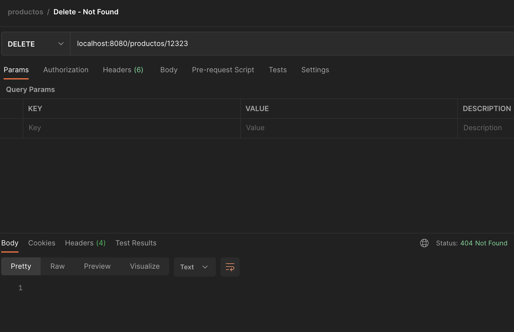
  

## WEB
Para el desarrollo de la aplicación web se usó Angular 12 y Angular Material como librería de componentes gráficos. Se crearon dos componentes `usuarios-tabla` y `usuarios-lista`, los cuales se pueden acceder a través de los paths `tabla` y `lista` respectivamente. 

Para ejecutar el proyecto debe ejecutar DOS comandos, los cuales son los siguientes:

```shell
npm install
export NODE_OPTIONS=--openssl-legacy-provide
ng serve
```

Si no ejecuta el primer comando es posible que aparezca el siguiente error:
```shell
Generating browser application bundles (phase: building)...node:internal/crypto/hash:69
this[kHandle] = new _Hash(algorithm, xofLen);
                ^

Error: error:0308010C:digital envelope routines::unsupported
    at new Hash (node:internal/crypto/hash:69:19)
    at Object.createHash (node:crypto:138:10)
```

Los componentes son los siguientes:
* usuarios-tabla:
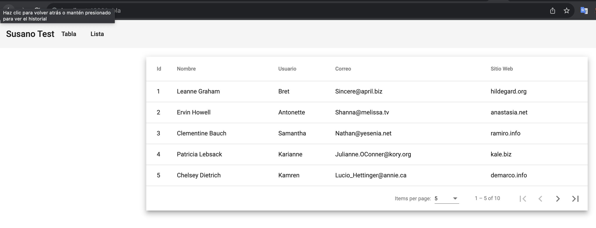


* usuarios-lista:
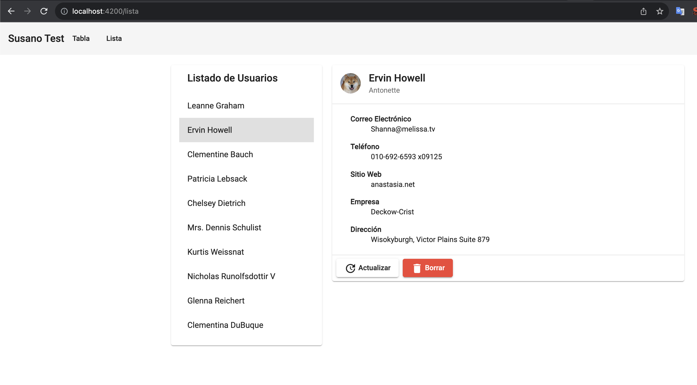